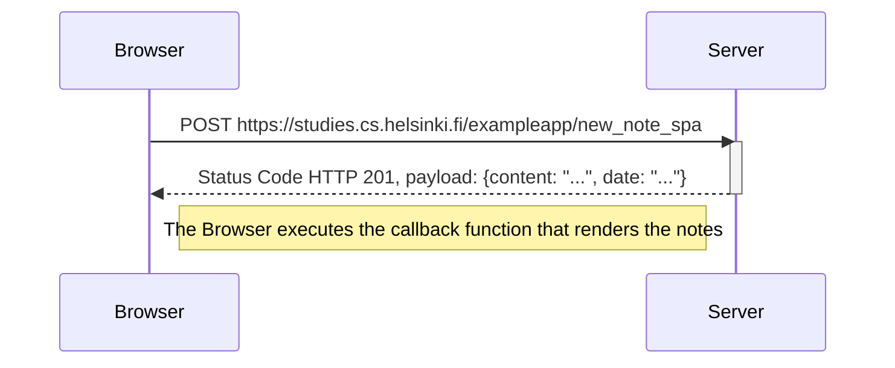

```mermaid
sequenceDiagram
    participant Browser
    participant Server

    Browser->>Server: POST https://studies.cs.helsinki.fi/exampleapp/new_note_spa
    activate Server
    Server-->>Browser: Status Code HTTP 201, payload: {content: "...", date: "..."}
    deactivate Server

    Note right of Browser: The Browser executes the callback function that renders the notes
```
